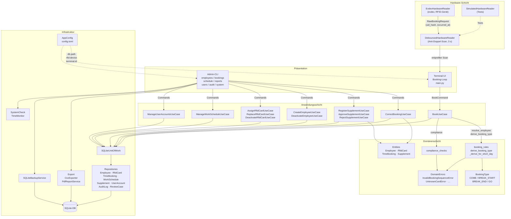

# Architekturdiagramm — arbeitszeit (Gesamtübersicht)

```mermaid
flowchart TD
    subgraph Presentation["Präsentation"]
        TUI["Terminal-UI\nBooking-Loop\nmain.py"]
        CLI["Admin-CLI\nemployees / bookings\nschedule / reports\nusers / audit / system"]
    end

    subgraph Hardware["Hardware-Schicht"]
        DEBOUNCE["DebouncedHardwareReader\n(Anti-Doppel-Scan, 3 s)"]
        EVDEV["EvdevHardwareReader\n(evdev, RFID-Gerät)"]
        SIM["SimulatedHardwareReader\n(Tests)"]
    end

    subgraph Application["Anwendungsschicht"]
        BOOK["BookUseCase"]
        CORRECT["CorrectBookingUseCase"]
        SUPPLEMENT["RegisterSupplementUseCase\nApproveSupplementUseCase\nRejectSupplementUseCase"]
        EMPLOYEES["CreateEmployeeUseCase\nDeactivateEmployeeUseCase"]
        CARDS["AssignRfidCardUseCase\nReplaceRfidCardUseCase\nDeactivateRfidCardUseCase"]
        SCHEDULE["ManageWorkScheduleUseCase"]
        USERS["ManageUserAccountsUseCase"]
    end

    subgraph Domain["Domänenschicht"]
        BOOKING_RULES["booking_rules\nderive_booking_type\n_derive_for_short_day"]
        COMPLIANCE["compliance_checks"]
        ENTITIES["Entities\nEmployee · RfidCard\nTimeBooking · Supplement"]
        ERRORS["DomainErrors\nInvalidBookingSequenceError\nUnknownCardError · …"]
        ENUMS["BookingType\nCOME / BREAK_START\nBREAK_END / GO"]
    end

    subgraph Infrastructure["Infrastruktur"]
        UOW["SQLiteUnitOfWork"]
        REPOS["Repositories\nEmployee · RfidCard\nTimeBooking · WorkSchedule\nSupplement · UserAccount\nAuditLog · ReviewCase"]
        EXPORT["Export\nCsvExporter\nPdfReportService"]
        BACKUP["SQLiteBackupService"]
        SYSCHECK["SystemCheck\nTimeMonitor"]
        CONFIG["AppConfig\nconfig.toml"]
        DB[("SQLite-DB")]
    end

    %% Hardware-Kette
    EVDEV -->|"RawBookingRequest\n(uid_hash, occurred_at)"| DEBOUNCE
    SIM -.->|Tests| DEBOUNCE
    DEBOUNCE -->|entprellter Scan| TUI

    %% Presentation → Application
    TUI -->|BookCommand| BOOK
    CLI -->|Commands| CORRECT
    CLI -->|Commands| SUPPLEMENT
    CLI -->|Commands| EMPLOYEES
    CLI -->|Commands| CARDS
    CLI -->|Commands| SCHEDULE
    CLI -->|Commands| USERS

    %% Application → Domain
    BOOK -->|"resolve_employee\nderive_booking_type"| BOOKING_RULES
    BOOK -->|compliance| COMPLIANCE
    CORRECT --> ENTITIES
    SUPPLEMENT --> ENTITIES

    %% Domain-intern
    BOOKING_RULES --> ENUMS
    BOOKING_RULES --> ERRORS
    COMPLIANCE --> ERRORS

    %% Application → Infrastructure
    BOOK --> UOW
    CORRECT --> UOW
    SUPPLEMENT --> UOW
    EMPLOYEES --> UOW
    CARDS --> UOW
    SCHEDULE --> UOW
    USERS --> UOW
    CLI --> EXPORT
    CLI --> BACKUP
    CLI --> SYSCHECK

    %% Infrastructure → DB
    UOW --> REPOS
    REPOS --> DB
    EXPORT --> DB
    BACKUP --> DB
    CONFIG -.->|"db.path\nrfid-device\nterminal.id"| TUI
    CONFIG -.-> CLI
```
