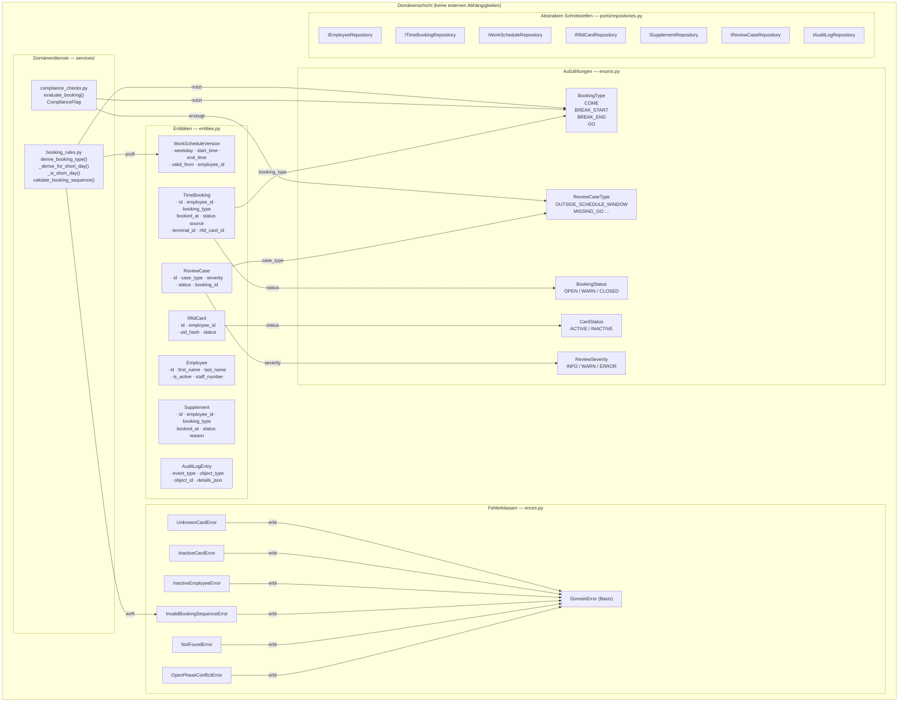

# Domain-Architektur

```mermaid
flowchart TD
    subgraph Domain["Domänenschicht (keine externen Abhängigkeiten)"]

        subgraph Entities["Entitäten — entities.py"]
            Employee["Employee\n· id · first_name · last_name\n· is_active · staff_number"]
            TimeBooking["TimeBooking\n· id · employee_id · booking_type\n· booked_at · status · source\n· terminal_id · rfid_card_id"]
            RfidCard["RfidCard\n· id · employee_id\n· uid_hash · status"]
            WorkScheduleVersion["WorkScheduleVersion\n· weekday · start_time · end_time\n· valid_from · employee_id"]
            Supplement["Supplement\n· id · employee_id · booking_type\n· booked_at · status · reason"]
            ReviewCase["ReviewCase\n· id · case_type · severity\n· status · booking_id"]
            AuditLogEntry["AuditLogEntry\n· event_type · object_type\n· object_id · details_json"]
        end

        subgraph Enums["Aufzählungen — enums.py"]
            BookingType["BookingType\nCOME\nBREAK_START\nBREAK_END\nGO"]
            BookingStatus["BookingStatus\nOPEN / WARN / CLOSED"]
            CardStatus["CardStatus\nACTIVE / INACTIVE"]
            ReviewCaseType["ReviewCaseType\nOUTSIDE_SCHEDULE_WINDOW\nMISSING_GO …"]
            ReviewSeverity["ReviewSeverity\nINFO / WARN / ERROR"]
        end

        subgraph Errors["Fehlerklassen — errors.py"]
            DomainError["DomainError (Basis)"]
            UnknownCardError["UnknownCardError"]
            InactiveCardError["InactiveCardError"]
            InactiveEmployeeError["InactiveEmployeeError"]
            InvalidBookingSequenceError["InvalidBookingSequenceError"]
            NotFoundError["NotFoundError"]
            OpenPhaseConflictError["OpenPhaseConflictError"]
        end

        subgraph Services["Domänendienste — services/"]
            BookingRules["booking_rules.py\nderive_booking_type()\n_derive_for_short_day()\n_is_short_day()\nvalidate_booking_sequence()"]
            Compliance["compliance_checks.py\nevaluate_booking()\nComplianceFlag"]
        end

        subgraph Ports["Abstrakten Schnittstellen — ports/repositories.py"]
            IEmployeeRepo["IEmployeeRepository"]
            ITimeBookingRepo["ITimeBookingRepository"]
            IWorkScheduleRepo["IWorkScheduleRepository"]
            IRfidCardRepo["IRfidCardRepository"]
            ISupplementRepo["ISupplementRepository"]
            IReviewCaseRepo["IReviewCaseRepository"]
            IAuditLogRepo["IAuditLogRepository"]
        end
    end

    %% Dienst-Abhängigkeiten
    BookingRules -->|"nutzt"| BookingType
    BookingRules -->|"wirft"| InvalidBookingSequenceError
    BookingRules -->|"prüft"| WorkScheduleVersion
    Compliance -->|"nutzt"| BookingType
    Compliance -->|"erzeugt"| ReviewCaseType

    %% Vererbung Fehler
    UnknownCardError -->|"erbt"| DomainError
    InactiveCardError -->|"erbt"| DomainError
    InactiveEmployeeError -->|"erbt"| DomainError
    InvalidBookingSequenceError -->|"erbt"| DomainError
    NotFoundError -->|"erbt"| DomainError
    OpenPhaseConflictError -->|"erbt"| DomainError

    %% Entitäts-Beziehungen
    TimeBooking -->|"booking_type"| BookingType
    TimeBooking -->|"status"| BookingStatus
    RfidCard -->|"status"| CardStatus
    ReviewCase -->|"case_type"| ReviewCaseType
    ReviewCase -->|"severity"| ReviewSeverity
```
