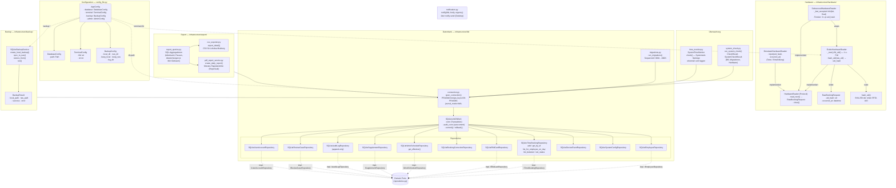

# Infrastruktur-Architektur

```mermaid
flowchart TD
    subgraph Config["Konfiguration — config_file.py"]
        AppConfig["AppConfig\n· database: DatabaseConfig\n· terminal: TerminalConfig\n· backup: BackupConfig\n· admin: AdminConfig"]
        DatabaseConfig["DatabaseConfig\n· path: Path"]
        TerminalConfig["TerminalConfig\n· rfid: str\n· id: int"]
        BackupConfig["BackupConfig\n· local_dir · nas_dir\n· keep_local · keep_nas\n· log_dir"]
        AppConfig --> DatabaseConfig
        AppConfig --> TerminalConfig
        AppConfig --> BackupConfig
    end

    subgraph Hardware["Hardware — infrastructure/hardware/"]
        HWPort["HardwareReader (Protocol)\n· read_next() → RawBookingRequest\n· close()"]
        RawReq["RawBookingRequest\n· uid_hash: str\n· occurred_at: datetime"]
        EvdevReader["EvdevHardwareReader\n· _read_rfid_uid() — 1-s-Poll\n· hash_uid(raw_uid) → uid_hash"]
        Debounce["DebouncedHardwareReader\n· _last_accepted: dict[str, float]\n· Fenster: 3 s je uid_hash"]
        Simulator["SimulatedHardwareReader\n· inject(uid_hash, occurred_at)\n(Tests / Entwicklung)"]
        UidHash["hash_uid()\nSHA-256 der rohen RFID-UID"]

        EvdevReader -->|"implementiert"| HWPort
        Debounce -->|"implementiert"| HWPort
        Simulator -->|"implementiert"| HWPort
        EvdevReader -->|"nutzt"| UidHash
        EvdevReader -->|"liefert"| RawReq
        Debounce -->|"wraps"| EvdevReader
    end

    subgraph DB["Datenbank — infrastructure/db/"]
        Conn["connection.py\nopen_connection()\nPRAGMA foreign_keys=ON\nPRAGMA journal_mode=WAL"]
        Migrations["migrations.py\nrun_migrations()\nSequenziell: 0001…000N"]
        UoW["SQLiteUnitOfWork\n· conn (Transaktion)\n· audit_conn (autocommit)\n· commit() / rollback()"]

        subgraph Repos["Repositories"]
            EmpRepo["SQLiteEmployeeRepository"]
            BookRepo["SQLiteTimeBookingRepository\nadd / get_by_id\nlist_for_employee_on_day\nlist_between / set_status"]
            CardRepo["SQLiteRfidCardRepository"]
            SchedRepo["SQLiteWorkScheduleRepository\nget_effective()"]
            SuppRepo["SQLiteSupplementRepository"]
            CorrRepo["SQLiteBookingCorrectionRepository"]
            ReviewRepo["SQLiteReviewCaseRepository"]
            AuditRepo["SQLiteAuditLogRepository\n(append-only)"]
            DevRepo["SQLiteDeviceEventRepository"]
            SysRepo["SQLiteSystemConfigRepository"]
            UserRepo["SQLiteUserAccountRepository"]
        end

        UoW --> EmpRepo
        UoW --> BookRepo
        UoW --> CardRepo
        UoW --> SchedRepo
        UoW --> SuppRepo
        UoW --> CorrRepo
        UoW --> ReviewRepo
        UoW --> AuditRepo
        UoW --> DevRepo
        UoW --> SysRepo
        UoW --> UserRepo
        Conn --> UoW
        Migrations --> Conn
    end

    subgraph Export["Export — infrastructure/export/"]
        ReportQueries["report_queries.py\nSQL-Aggregationen\n(Arbeitszeit, Pausen,\nAbweichungen je MA+Zeitraum)"]
        CsvExport["csv_exporter.py\nexport_detail()\nCSV für Lohnbuchhaltung"]
        PdfReport["pdf_report_service.py\ncreate_daily_report()\nMonats-/Tagesberichte (ReportLab)"]
        ReportQueries --> CsvExport
        ReportQueries --> PdfReport
    end

    subgraph Backup["Backup — infrastructure/backup/"]
        BackupSvc["SQLiteBackupService\ncreate_local_backup()\nsync_to_nas()\nrestore_from()\nrun()"]
        BackupResult["BackupResult\n· local_path · nas_path\n· success · error"]
        BackupSvc --> BackupResult
    end

    subgraph Monitoring["Überwachung"]
        SysCheck["system_check.py\nrun_system_check()\nCheckResult · SystemCheckResult\n(DB, Migrationen, Hardware)"]
        TimeMonitor["time_monitor.py\nSystemTimeMonitor\ncheck() — Systemzeit-Sprünge\nerkennen und loggen"]
    end

    Notify["notification.py\nnotify(title, body, urgency)\nüber notify-send (Desktop)"]

    %% Abhängigkeiten zur DB
    Export --> Conn
    Backup --> Conn
    SysCheck --> Conn
    TimeMonitor --> Conn

    %% Domain-Ports implementiert durch Repositories
    EmpRepo -.->|"impl. IEmployeeRepository"| DomPorts[("Domain Ports\n(repositories.py)")]
    BookRepo -.->|"impl. ITimeBookingRepository"| DomPorts
    CardRepo -.->|"impl. IRfidCardRepository"| DomPorts
    SchedRepo -.->|"impl. IWorkScheduleRepository"| DomPorts
    SuppRepo -.->|"impl. ISupplementRepository"| DomPorts
    AuditRepo -.->|"impl. IAuditLogRepository"| DomPorts
    ReviewRepo -.->|"impl. IReviewCaseRepository"| DomPorts
    UserRepo -.->|"impl. IUserAccountRepository"| DomPorts

    %% Config-Nutzung
    AppConfig -.->|"db.path"| Conn
    AppConfig -.->|"backup.*"| BackupSvc
    AppConfig -.->|"terminal.rfid"| EvdevReader
```
