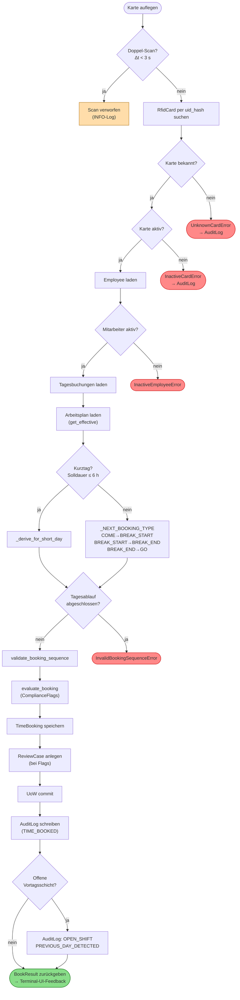

# RFID-Buchungsablauf

```mermaid
flowchart TD
    START(["Karte auflegen"])
    DEBOUNCE{"Doppel-Scan?\nΔt < 3 s"}
    DISCARD["Scan verworfen\n(INFO-Log)"]
    CARD_LOOKUP["RfidCard per uid_hash suchen"]
    CARD_KNOWN{"Karte bekannt?"}
    CARD_ACTIVE{"Karte aktiv?"}
    EMP_LOOKUP["Employee laden"]
    EMP_ACTIVE{"Mitarbeiter aktiv?"}
    DAY_BOOKINGS["Tagesbuchungen laden"]
    SCHEDULE["Arbeitsplan laden\n(get_effective)"]
    SHORT_DAY{"Kurztag?\nSolldauer ≤ 6 h"}
    DERIVE_SHORT["_derive_for_short_day"]
    DERIVE_LONG["_NEXT_BOOKING_TYPE\nCOME→BREAK_START\nBREAK_START→BREAK_END\nBREAK_END→GO"]
    SEQ_DONE{"Tagesablauf\nabgeschlossen?"}
    VALIDATE["validate_booking_sequence"]
    COMPLIANCE["evaluate_booking\n(ComplianceFlags)"]
    PERSIST["TimeBooking speichern"]
    REVIEW_CASES["ReviewCase anlegen\n(bei Flags)"]
    COMMIT["UoW commit"]
    AUDIT["AuditLog schreiben\n(TIME_BOOKED)"]
    OPEN_SHIFT{"Offene\nVortagsschicht?"}
    AUDIT2["AuditLog: OPEN_SHIFT\nPREVIOUS_DAY_DETECTED"]
    RESULT(["BookResult zurückgeben\n→ Terminal-UI-Feedback"])

    ERR_UNKNOWN(["UnknownCardError\n→ AuditLog"])
    ERR_INACTIVE_CARD(["InactiveCardError\n→ AuditLog"])
    ERR_INACTIVE_EMP(["InactiveEmployeeError"])
    ERR_SEQ(["InvalidBookingSequenceError"])

    START --> DEBOUNCE
    DEBOUNCE -->|"ja"| DISCARD
    DEBOUNCE -->|"nein"| CARD_LOOKUP
    CARD_LOOKUP --> CARD_KNOWN
    CARD_KNOWN -->|"nein"| ERR_UNKNOWN
    CARD_KNOWN -->|"ja"| CARD_ACTIVE
    CARD_ACTIVE -->|"nein"| ERR_INACTIVE_CARD
    CARD_ACTIVE -->|"ja"| EMP_LOOKUP
    EMP_LOOKUP --> EMP_ACTIVE
    EMP_ACTIVE -->|"nein"| ERR_INACTIVE_EMP
    EMP_ACTIVE -->|"ja"| DAY_BOOKINGS
    DAY_BOOKINGS --> SCHEDULE
    SCHEDULE --> SHORT_DAY
    SHORT_DAY -->|"ja"| DERIVE_SHORT
    SHORT_DAY -->|"nein"| DERIVE_LONG
    DERIVE_SHORT --> SEQ_DONE
    DERIVE_LONG --> SEQ_DONE
    SEQ_DONE -->|"ja"| ERR_SEQ
    SEQ_DONE -->|"nein"| VALIDATE
    VALIDATE --> COMPLIANCE
    COMPLIANCE --> PERSIST
    PERSIST --> REVIEW_CASES
    REVIEW_CASES --> COMMIT
    COMMIT --> AUDIT
    AUDIT --> OPEN_SHIFT
    OPEN_SHIFT -->|"ja"| AUDIT2
    OPEN_SHIFT -->|"nein"| RESULT
    AUDIT2 --> RESULT

    style ERR_UNKNOWN fill:#f88,stroke:#c00
    style ERR_INACTIVE_CARD fill:#f88,stroke:#c00
    style ERR_INACTIVE_EMP fill:#f88,stroke:#c00
    style ERR_SEQ fill:#f88,stroke:#c00
    style DISCARD fill:#fda,stroke:#a60
    style RESULT fill:#8d8,stroke:#060
```
