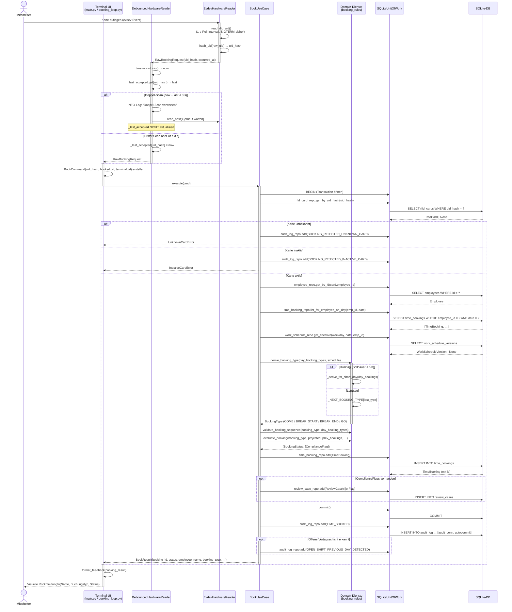

# Sequenzfluss: read_next() → BookUseCase

```mermaid
sequenceDiagram
    actor Mitarbeiter
    participant TUI as Terminal-UI<br/>(main.py / booking_loop.py)
    participant DBR as DebouncedHardwareReader
    participant EVD as EvdevHardwareReader
    participant BUC as BookUseCase
    participant DOM as Domain-Dienste<br/>(booking_rules)
    participant UOW as SQLiteUnitOfWork
    participant DB as SQLite-DB

    Mitarbeiter->>EVD: Karte auflegen (evdev-Event)
    activate EVD
    EVD->>EVD: _read_rfid_uid()<br/>(1-s-Poll-Intervall, SIGTERM-sicher)
    EVD->>EVD: hash_uid(raw_uid) → uid_hash
    EVD-->>DBR: RawBookingRequest(uid_hash, occurred_at)
    deactivate EVD

    activate DBR
    DBR->>DBR: time.monotonic() → now
    DBR->>DBR: _last_accepted.get(uid_hash) → last

    alt Doppel-Scan (now − last < 3 s)
        DBR->>DBR: INFO-Log: "Doppel-Scan verworfen"
        DBR->>EVD: read_next() [erneut warten]
        Note over DBR: _last_accepted NICHT aktualisiert
    else Erster Scan oder Δt ≥ 3 s
        DBR->>DBR: _last_accepted[uid_hash] = now
        DBR-->>TUI: RawBookingRequest
    end
    deactivate DBR

    activate TUI
    TUI->>TUI: BookCommand(uid_hash, booked_at, terminal_id) erstellen
    TUI->>BUC: execute(cmd)
    deactivate TUI

    activate BUC
    BUC->>UOW: BEGIN (Transaktion öffnen)
    BUC->>UOW: rfid_card_repo.get_by_uid_hash(uid_hash)
    UOW->>DB: SELECT rfid_cards WHERE uid_hash = ?
    DB-->>UOW: RfidCard | None

    alt Karte unbekannt
        BUC->>UOW: audit_log_repo.add(BOOKING_REJECTED_UNKNOWN_CARD)
        BUC-->>TUI: UnknownCardError
    else Karte inaktiv
        BUC->>UOW: audit_log_repo.add(BOOKING_REJECTED_INACTIVE_CARD)
        BUC-->>TUI: InactiveCardError
    else Karte aktiv
        BUC->>UOW: employee_repo.get_by_id(card.employee_id)
        UOW->>DB: SELECT employees WHERE id = ?
        DB-->>UOW: Employee

        BUC->>UOW: time_booking_repo.list_for_employee_on_day(emp_id, date)
        UOW->>DB: SELECT time_bookings WHERE employee_id = ? AND date = ?
        DB-->>UOW: [TimeBooking, …]

        BUC->>UOW: work_schedule_repo.get_effective(weekday, date, emp_id)
        UOW->>DB: SELECT work_schedule_versions …
        DB-->>UOW: WorkScheduleVersion | None

        BUC->>DOM: derive_booking_type(day_booking_types, schedule)
        activate DOM
        alt Kurztag (Solldauer ≤ 6 h)
            DOM->>DOM: _derive_for_short_day(day_bookings)
        else Langtag
            DOM->>DOM: _NEXT_BOOKING_TYPE[last_type]
        end
        DOM-->>BUC: BookingType (COME / BREAK_START / BREAK_END / GO)
        deactivate DOM

        BUC->>DOM: validate_booking_sequence(booking_type, day_booking_types)
        BUC->>DOM: evaluate_booking(booking_type, projected, prev_bookings, …)
        DOM-->>BUC: (BookingStatus, [ComplianceFlag])

        BUC->>UOW: time_booking_repo.add(TimeBooking)
        UOW->>DB: INSERT INTO time_bookings …
        DB-->>UOW: TimeBooking (mit id)

        opt ComplianceFlags vorhanden
            BUC->>UOW: review_case_repo.add(ReviewCase) [je Flag]
            UOW->>DB: INSERT INTO review_cases …
        end

        BUC->>UOW: commit()
        UOW->>DB: COMMIT

        BUC->>UOW: audit_log_repo.add(TIME_BOOKED)
        UOW->>DB: INSERT INTO audit_log … [audit_conn, autocommit]

        opt Offene Vortagsschicht erkannt
            BUC->>UOW: audit_log_repo.add(OPEN_SHIFT_PREVIOUS_DAY_DETECTED)
        end

        BUC-->>TUI: BookResult(booking_id, status, employee_name, booking_type, …)
    end
    deactivate BUC

    activate TUI
    TUI->>TUI: format_feedback(booking_result)
    TUI-->>Mitarbeiter: Visuelle Rückmeldung\n(Name, Buchungstyp, Status)
    deactivate TUI
```
